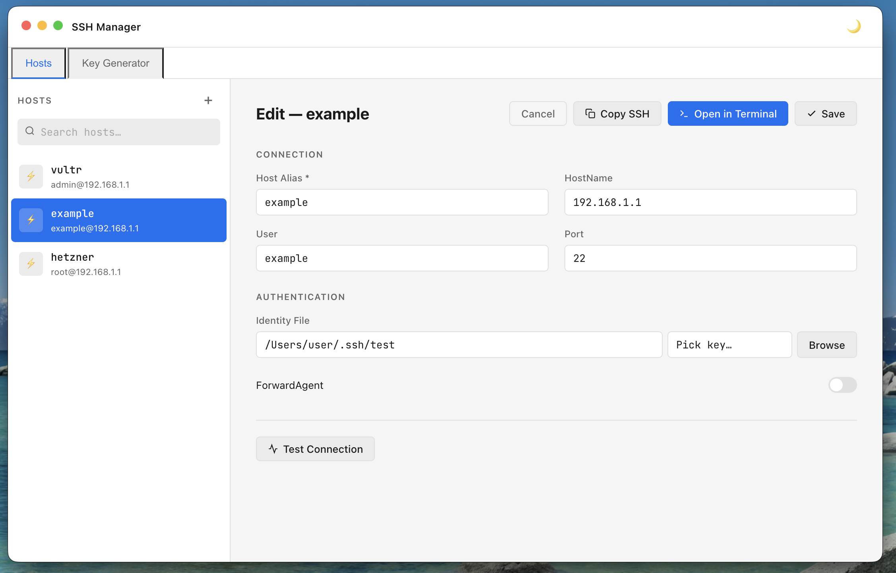
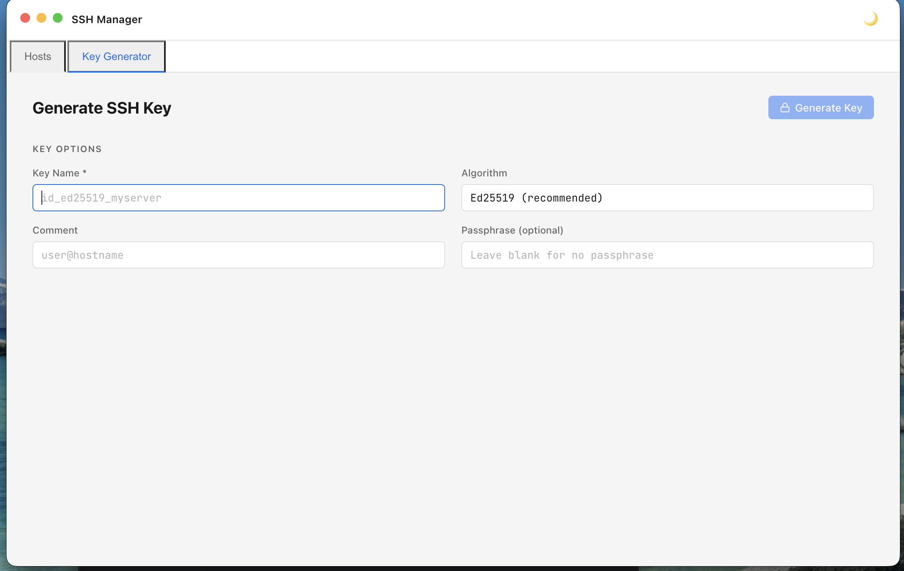

# SSH Manager

A desktop app for managing your `~/.ssh/config` file with a clean GUI on Windows and macOS.

Built with **Electron + React + TypeScript**.


## Screenshots

<table>
  <tr>
    <td></td>
    <td></td>
  </tr>
  <tr>
    <td align="center">Host Editor</td>
    <td align="center">Key Generator</td>
  </tr>
</table>

## Features

- 📋 **Host List** — browse, search, and filter all SSH hosts
- ✏️ **Host Editor** — add/edit hosts with a form (alias, hostname, user, port, identity file, ForwardAgent)
- 🔌 **Connection Test** — checks if a host is reachable
- 💻 **Open in Terminal** — launch `ssh <alias>` directly in a platform-appropriate terminal
- 🔑 **Key Generator** — generate Ed25519 or RSA 4096 keys via `ssh-keygen`
- 🌙 **Dark / Light theme** — persisted in localStorage
- 💾 **Auto backup** — saves `~/.ssh/config.bak` before every write

## Download

Grab the latest installer from [Releases](../../releases). Windows builds produce an `.exe`; macOS builds produce a `.dmg`.

## Development

```bash
npm install
npm run dev       # Electron + Vite HMR
```

## Build

```bash
npm run build       # Builds the app for the current platform
npm run build:win   # Produces a Windows NSIS installer
```

Windows builds produce `release/SSH Manager Setup x.x.x.exe`.
macOS builds produce a universal binary (arm64 + x64).

## Security

- `contextIsolation: true`, `nodeIntegration: false`
- All Node.js operations run in the main process via IPC
- User input is sanitized before being passed to shell commands

## License

MIT
